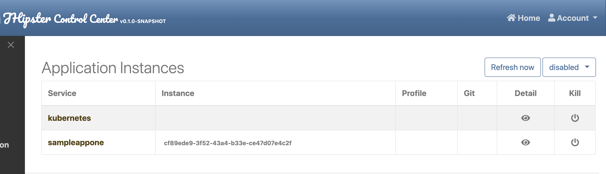
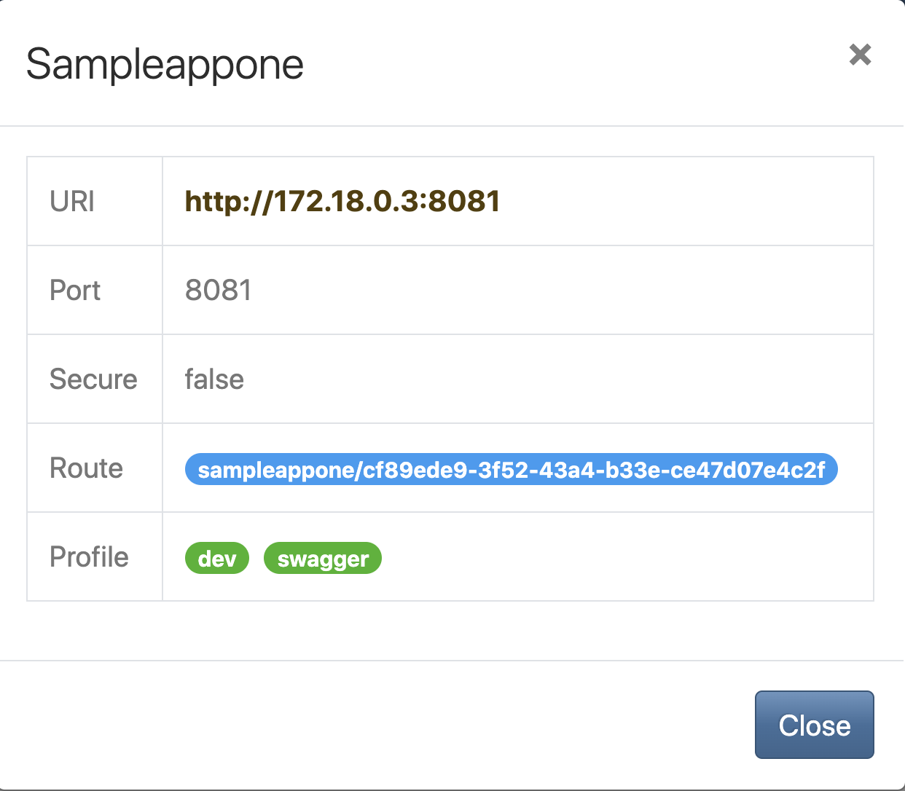
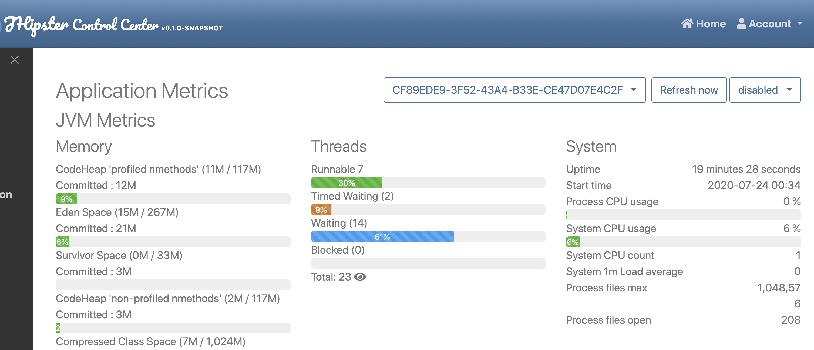
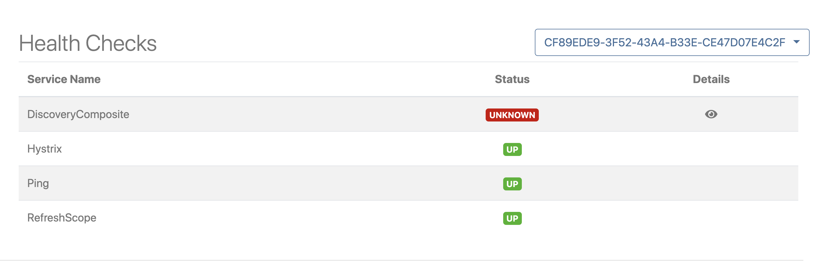

# Samples App for JHipster Control Center

Repository with samples to test JHipster Control Center Kubernetes Integration.

## Quickstart

Install and start [Minikube](https://github.com/kubernetes/minikube).

Create a RoleBinding for Kubernetes Service Discovery

```shell script
kubectl create clusterrolebinding system-default-cluster-admin-binding --clusterrole=cluster-admin --user=system:serviceaccount:default:default
```

_Yeah, Cluster Admin, this is just a test!_

Run JHipster Control Center:

```shell script
kubectl run jhipstercontrolcenter --image=cedriclamalle/jhipstercontrolcenter --port=7419 --env="SPRING_PROFILES_ACTIVE=prod"
```

Map port 7419:

````shell script
kubectl port-forward pods/jhipstercontrolcenter 7419:7419
````

Now JHipster Control Center is running and available at http://localhost:7419. Next step is to run the sample app generated with [JHipster](https://www.jhipster.tech/) 6.10.1.

For this example we'll use [Skaffold](https://skaffold.dev/).

:warning:  you'll need to edit `src/main/resources/application.properties` and change the `dekorate.docker.group` to your dockerhub login.

```
git clone https://github.com/cedric-lamalle/jhipster-control-center-k8s-sample
cd jhipster-control-center-k8s-sample/sample-app-1
skaffold dev
```

This will build the executable, the Docker image with jib and deploy the application in Minikube.

## Screenshots

### Instances List



### Instance Details



### Application Metrics



### Health Checks


